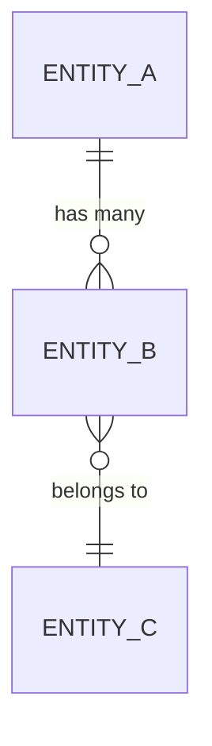

# Data Model Design

## Overview

Describe the data domain, key entities, and the storage approach.

## Entity Relationship Diagram



## Entities

### Entity A

| Field | Type | Nullable | Default | Description |
|-------|------|----------|---------|-------------|
| `id` | UUID | No | auto | Primary key |
| `name` | string | No | | Display name |
| `createdAt` | timestamp | No | now() | Creation time |
| `updatedAt` | timestamp | No | now() | Last update |

**Indexes:**
- `idx_entity_a_name` — unique on `name`

### Entity B

| Field | Type | Nullable | Default | Description |
|-------|------|----------|---------|-------------|
| `id` | UUID | No | auto | Primary key |
| `entityAId` | UUID (FK) | No | | Foreign key to Entity A |

**Indexes:**
- `idx_entity_b_entity_a_id` — on `entityAId`

## Relationships

- **Entity A → Entity B**: One-to-many. 
- **Entity B → Entity C**: Many-to-one. 

## Migration Strategy

### Phase 1: Schema Creation

```sql
-- Migration: 001_create_entity_a
CREATE TABLE entity_a (
  id UUID PRIMARY KEY DEFAULT gen_random_uuid(),
  name TEXT NOT NULL,
  created_at TIMESTAMPTZ NOT NULL DEFAULT NOW()
);
```

### Phase 2: Data Migration

Describe the data migration approach for existing data.

## Backward Compatibility

- **Breaking changes**: 
- **Deprecation timeline**: 
- **Data coexistence strategy**: 

## Performance Considerations

- **Expected data volume**: 
- **Query patterns**: 
- **Caching strategy**: 

## Open Questions

- [ ] 
