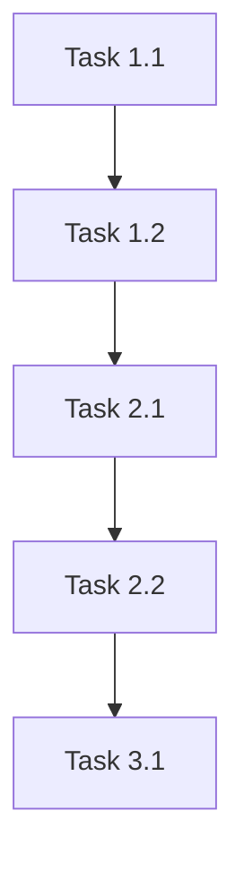

# Task Breakdown

## Overview

Brief summary of what this task breakdown covers and the overall implementation approach.

## Milestones

| Milestone | Target Date | Status | Description |
|-----------|-------------|--------|-------------|
| M1 | | Not Started | |
| M2 | | Not Started | |
| M3 | | Not Started | |

## Implementation Tasks

### Phase 1: Foundation

#### Task 1.1: [Title]

- **Owner**: 
- **Estimate**: 
- **Dependencies**: None
- **Description**: 
- **Acceptance Criteria**:
  - [ ] 

#### Task 1.2: [Title]

- **Owner**: 
- **Estimate**: 
- **Dependencies**: Task 1.1
- **Description**: 
- **Acceptance Criteria**:
  - [ ] 

### Phase 2: Core Implementation

#### Task 2.1: [Title]

- **Owner**: 
- **Estimate**: 
- **Dependencies**: Phase 1
- **Description**: 
- **Acceptance Criteria**:
  - [ ] 

#### Task 2.2: [Title]

- **Owner**: 
- **Estimate**: 
- **Dependencies**: Task 2.1
- **Description**: 
- **Acceptance Criteria**:
  - [ ] 

### Phase 3: Integration & Polish

#### Task 3.1: [Title]

- **Owner**: 
- **Estimate**: 
- **Dependencies**: Phase 2
- **Description**: 
- **Acceptance Criteria**:
  - [ ] 

## Dependency Graph

## Risk Items

| Risk | Impact | Mitigation |
|------|--------|------------|
| | | |

## Open Questions

- [ ] 
