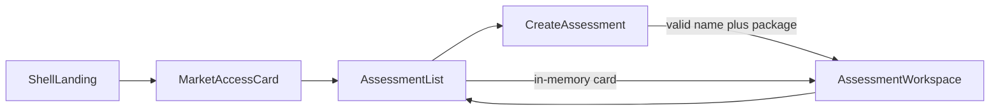

# PR 1 — Market Access UI foundation

Canonical PR 1 plan. Do not maintain a second evolving copy elsewhere.

**Goal:** register a Market Access app in AIShell and establish the guided create → workspace UX. **UI foundation only.**

**Status:** **Complete** (Phases 1–5). PR 2 planning is separate.

**Not this PR:** filesystem or project-directory creation, real persistence, package parsing, backend/server routes, Cursor CLI or other agent invocation, internet research, analog generation, knowledge-repository generation, Navlin, presentation generation, confidential Alnylam data, SaaS/auth/cloud infrastructure.

---

## 1. Goal and scope

Smallest coherent UI for business users:

- Open Market Access from the shell landing page
- Land on an assessments list
- Create an assessment with **product/drug name** + **one** package document (Markdown or DOCX)
- Enter an assessment workspace shell with placeholders for later Analog / evidence / knowledge work

Mock/local UI state is allowed only to demonstrate navigation. PR 2 will add real local persistence.

Work **one internal phase at a time**. Stop after each phase for review.

**Progress:** Phases 1–5 implemented. PR 1 UI foundation complete.

---

## 2. Repository findings and reference implementations

AIShell is a React 19 + TypeScript + Zustand + Vite container. Apps plug in through a compile-time `AppManifest`. The shell owns `/:appId` and layout query params; each app owns sub-routes via [`useAppSubRoute`](../../../../src/shell/useAppSubRoute.ts). There is no existing market-access app.

| Pattern | Best reference | Why |
| --- | --- | --- |
| New-app checklist, tokens, docs | [`APP_DEVELOPMENT_GUIDE.md`](../../../../APP_DEVELOPMENT_GUIDE.md), [`.agents/AGENTS.md`](../../../../.agents/AGENTS.md), shell [`ARCHITECTURE.md`](../../../../ARCHITECTURE.md) | Authoritative chassis contract |
| Manifest + registry | [`src/types/app.ts`](../../../../src/types/app.ts), [`src/apps/registry.ts`](../../../../src/apps/registry.ts), [`src/apps/hello-world/manifest.tsx`](../../../../src/apps/hello-world/manifest.tsx) | Only shell interface |
| Hub → workspace routing | [`src/apps/music-creator/MusicCreatorContent.tsx`](../../../../src/apps/music-creator/MusicCreatorContent.tsx) | Closest list/create/workspace URL model; `useAppSubRoute`; empty states |
| Dedicated create form | [`src/apps/db-helper/ConnectionForm.tsx`](../../../../src/apps/db-helper/ConnectionForm.tsx), [`ConnectionList.tsx`](../../../../src/apps/db-helper/ConnectionList.tsx) | Controlled inputs, labels, `validate()` → `string \| null`, empty-state CTA |
| File-selection UI (not FS paths) | [`src/apps/codascope/components/SourceUpload.tsx`](../../../../src/apps/codascope/components/SourceUpload.tsx) | Hidden `<input type="file">`, drop zone, keyboard, `accept`, type hint. **Do not copy the POST/upload.** |
| Left nav / collapsed mode | [`src/apps/music-creator/MusicCreatorNav.tsx`](../../../../src/apps/music-creator/MusicCreatorNav.tsx) | Shell `nav-item` classes; custom nav blocks break collapsed mode |
| Docs / icons / empty states | [`src/apps/codascope/ARCHITECTURE.md`](../../../../src/apps/codascope/ARCHITECTURE.md), [`AGENTS.md`](../../../../src/apps/codascope/AGENTS.md) | Progressive disclosure; SVG-only icons |
| Tests | music-creator colocated `*.test.ts` | Vitest for pure helpers only |

**Do not use in PR 1**

- [`FolderPicker`](../../../../src/shared/folder-picker/FolderPicker.tsx) — filesystem paths via `/api/filesystem/*` (PR 2)
- CodaScope Zustand / API / SSE / `@cursor/sdk` (PR 3+)
- db-helper’s hand-rolled `pushState` — use `useAppSubRoute`
- Right/bottom panels, secrets, command-bus handlers
- A module-level `useSyncExternalStore` session store (see §6)

**Boundary:** PR 1 stays in `src/apps/market-access/` plus shell wiring (`registry.ts`, `src/styles.css`, shell `ARCHITECTURE.md` directory map). No `server/` changes.

---

## 3. App ID and terminology

| Item | Value |
| --- | --- |
| App ID / folder / CSS | `market-access` / `src/apps/market-access/` / `.market-access-*` |
| Display name | **Market Access** (keep broad; do not name the app Analog Assessment) |
| Landing subtitle | Research pharmaceutical analogs and build evidence-backed assessments |
| Accent | `hsl(172, 55%, 42%)` |
| Icon | Inline geometric SVG in `manifest.tsx` (stroke style like CodaScope / music-creator) |

**User-facing noun:** **assessment** — one workspace for one product/asset.

**Spelling (mandatory):** `analog`, `analogs`, `Analog`, `AnalogAssessment`. Never “analogue”.

**AnalogAssessment** is the first assessment *kind* (analog research). PR 1 code uses a generic `Assessment` view-model for the workspace so later kinds are not boxed out.

Future runtime language (docs only): **agent / coding-agent layer**, provider-agnostic. Do not name UI or modules after Cursor.

Conceptual hierarchy (do not implement a knowledge schema in PR 1):

```
source material / provenance
        ↓
structured or extracted project knowledge
        ↓
generated synthesis / assessment
```

Placeholder copy must not imply that generated synthesis is authoritative. Humans review; sources remain the evidence.

---

## 4. PR 1 user flow



1. Shell landing (`/`) shows the Market Access card after registry.
2. Open app → assessments list (`/market-access/assessments`). Empty state + one primary CTA. Honest copy: nothing is saved to disk yet.
3. Create (`/market-access/assessments/new`): product name, one Markdown or DOCX package, helper text, **Create assessment** / **Cancel**.
4. Valid submit → hold the assessment in **root React state** and navigate to `/market-access/assessments/:id`.
5. Workspace: product name, package file metadata (name/size/kind only), placeholder cards for Analogs, Evidence, and Knowledge. Left nav returns to the list.
6. Same-session list may show created cards so reopen can be reviewed. Refresh or unknown id → list + “not found / not saved yet” banner.

Assumptions for this UX (later questions stay deferred): one assessment ↔ one product/asset; product name required; one package file required; Markdown + DOCX only; no confidential client data.

---

## 5. Proposed views and components

**Include**

- Assessment list (empty + in-memory cards)
- Dedicated create page (not a modal)
- Product name field
- Package file picker (click + drop) with `.md` / `.markdown` / `.docx` guidance
- **Create assessment** / **Cancel**
- Workspace overview shell
- Placeholder cards on overview (layout only)
- Left nav: All assessments; in workspace: Overview active; Analogs / Evidence / Knowledge **disabled** with “Coming later” titles

**Exclude**

- Right panel, bottom panel, headerItems, commands, secrets
- Routed `/analogs`, `/evidence`, `/knowledge` pages
- Rename / delete / duplicate
- Seed analog data
- Multi-step wizard

**Components**

- `MarketAccessContent` — URL router; owns in-memory assessments
- `MarketAccessNav` — URL-only; no product-name lookup
- `views/AssessmentList`
- `views/CreateAssessment`
- `views/AssessmentWorkspace`
- `components/PackageFilePicker` — SourceUpload interaction **without** `fetch`
- `components/MarketAccessIcons`

---

## 6. State ownership

Compared and **rejected** a dedicated session module (`sessionStore.ts` + `useSyncExternalStore`):

| Option | Verdict |
| --- | --- |
| A. Module session store | **No.** Extra infrastructure for behavior PR 2 will replace. Justified only if `leftNav` and `mainContent` must share data they cannot get from the URL. They do not: nav can be URL-driven; product name lives in the canvas. |
| B. Root React state in `MarketAccessContent` | **Yes.** `useState<Assessment[]>` (or equivalent) in the router. List, create, and workspace receive props. Refresh clears state. No Zustand. Easy to replace with persistence in PR 2. |
| C. Create → workspace only, no list cards | **No.** Saving one `useState` is not extra architecture; populated list + reopen is worth reviewing in PR 1. |

| Concern | Owner |
| --- | --- |
| Current view | URL via `useAppSubRoute("market-access")` |
| Create-form fields / errors | Local `useState` in `CreateAssessment` |
| Package selection | Form state. On submit, store `{ fileName, fileSize, kind }` only — not the `File` blob, not a filesystem path |
| In-memory assessments | `MarketAccessContent` React state |
| Shell layout | Existing `useShellStore` |

Do not call `/api/*`. Do not use `localStorage`.

---

## 7. Routing

Use [`useAppSubRoute("market-access")`](../../../../src/shell/useAppSubRoute.ts).

- `/market-access` → `replace("assessments")`
- `/market-access/assessments` — list
- `/market-access/assessments/new` — create (`new` reserved before `:id`)
- `/market-access/assessments/:id` — workspace overview
- Unknown path or unknown id → list + flash banner

Later PRs may add `/assessments/:id/analogs` (and similar). Do not add those routes now.

---

## 8. Expected files (full PR 1)

Already created this planning pass (do not recreate): `DEVELOPMENT.md`, `ARCHITECTURE.md`, `AGENTS.md`, `plans/README.md`, this file.

**Create during implementation**

- `manifest.tsx`, `market-access.css`
- `MarketAccessContent.tsx`, `MarketAccessNav.tsx`, `types.ts`
- `packageFile.ts`, `packageFile.test.ts` — kind/extension helpers shared by picker + submit; enough pure logic to justify tests
- `components/MarketAccessIcons.tsx`, `components/PackageFilePicker.tsx`
- `views/AssessmentList.tsx`, `views/CreateAssessment.tsx`, `views/AssessmentWorkspace.tsx`

**Do not create in PR 1:** `sessionStore.ts`, `validateCreate.ts`, `validateCreate.test.ts`, `development_prompts/`. Name/required-file checks stay colocated in `CreateAssessment`.

**Modify**

- [`src/apps/registry.ts`](../../../../src/apps/registry.ts)
- [`src/styles.css`](../../../../src/styles.css)
- Shell [`ARCHITECTURE.md`](../../../../ARCHITECTURE.md) Level 1 directory map (one line)

No `server/` or `src/shared/` changes.

---

## 9. Internal implementation phases

Stop after each phase unless asked to continue.

### Phase 1 — Scaffold — done

App card opens from `/` to `/market-access` with a placeholder canvas. No list/create/workspace yet.

### Phase 2 — Routing and nav — done

`useAppSubRoute` table, left nav `nav-item`s, unknown-route handling, list/create/workspace **shells** (minimal headings, no form yet). The list includes a Create assessment button so routing can be exercised without typing URLs.

### Phase 3 — List + create form — done

Empty state, product name, `PackageFilePicker`, colocated create validation, Cancel / Create. Create navigates with stub id (full in-memory state in Phase 4).

### Phase 4 — Workspace overview — done

In-memory assessments in `MarketAccessContent`, workspace metadata + placeholder cards (Analogs / Evidence / Knowledge), session list cards, honest “not persisted” copy.

### Phase 5 — Hardening — done

`packageFile` tests, `npm run check`, durable manual checks in `AGENTS.md`, `ARCHITECTURE.md` Level 1 file map synced to implemented files.

---

## 10. Testing and verification

Vitest on pure helpers only:

- `packageFile`: `.md` / `.markdown` / `.docx` accepted; `.pdf`, `.doc`, `.txt`, no-extension rejected; kind mapping

Create-form “name required” stays in the view — do not extract a module solely to unit-test it.

Also: `npm run check`. No React Testing Library or Playwright.

**Manual (as each phase lands)**

- Phase 1: landing card → placeholder canvas
- Phase 2: deep links, back/forward, collapsed nav, shell `?nav=` preserved, no nested `<main>`
- Phase 3: validation `role="alert"`, drop/click picker, type guidance visible
- Phase 4: create → workspace, back to list + reopen, refresh loses in-memory assessments, unknown id banner
- Placeholders do not claim generated output is authoritative

---

## 11. Accessibility

Follow music-creator, [`LoginPage.tsx`](../../../../src/app/LoginPage.tsx), and SourceUpload:

- `role="region"` + `aria-labelledby`; no nested `<main>`
- Labels with `htmlFor` / `id`; `autoFocus` on product name
- Errors: `role="alert"`; `aria-invalid` / `aria-describedby`
- File zone: `role="button"`, `tabIndex={0}`, Enter/Space; hidden input `tabIndex={-1}`; `accept` **plus** visible type guidance
- Disabled future nav: `disabled` + `title`, not fake routes
- `:focus-visible` via tokens; `type="button"` on non-submit controls
- Decorative SVGs `aria-hidden`; no emoji
- Keep **Create assessment** enabled; validate on submit (DB Helper pattern)

---

## 12. Explicit non-goals

- Real directories, disk persistence, `localStorage` fake persistence
- Reading, parsing, or converting the package document
- Agent / Cursor CLI invocation, internet research, analog generation
- Knowledge-repository generation, Navlin, presentations
- Confidential Alnylam data or sample packages
- Auth, tenancy, SaaS, secrets
- FolderPicker or `/api/filesystem`
- Right-panel assistant, command bus, app Zustand
- CRUD beyond in-memory create + open
- PDF or legacy `.doc`
- `sessionStore` / `useSyncExternalStore` session infrastructure

---

## 13. Deferred decisions

Do not block PR 1 on:

- On-disk layout, root path, `assessment.json` vs other names
- Copy uploaded `File` vs pick an existing path (PR 2)
- Multi-document packages; additional file types
- Markdown vs DOCX normalization for an agent
- Country-specific research structure; analog taxonomy/axes
- Agent provider, streaming, prompts, tools, structured output (PR 3)
- Knowledge-repo schema; evidence validation; correction-to-agent-guidance (PR 4)
- Navlin; presentation generation
- Whether a right-panel assistant belongs here
- Eventual SaaS/cloud architecture
- Whether in-memory ids become filesystem ids

Keep views on an `Assessment` view-model (`productName`, package metadata). Do not pass filesystem paths or Cursor types into UI.

---

## 14. Blockers versus non-blocking ambiguity

**Non-blocking:** accent/icon, exact placeholder wording, whether the in-memory list holds one or many assessments this session (many is fine; keep the state in Content).

**PR 1 UX assumptions** (treat as settled unless reversed):

- Create requires **both** product name and one package file
- Single file per assessment for now
- Markdown + DOCX only (no PDF even though CodaScope uploads PDFs)

No remaining question blocks Phase 1.

---

## 15. Suggested commit messages

Suggest after each phase; do not auto-commit. Types should match the change:

| Phase | Suggestion |
| --- | --- |
| 1 | `chore: scaffold Market Access app registration` |
| 2 | `feat: add Market Access assessment routing and navigation` |
| 3 | `feat: add Market Access create-assessment form` |
| 4 | `feat: add Market Access assessment workspace overview` |
| 5 | `test: cover Market Access package-file validation` and/or `docs: sync Market Access architecture to PR 1 UI` |

If several phases land in one human commit, prefer one message that reflects the whole, e.g. `feat: add Market Access UI foundation`.

---

## Phase 1 only (implemented)

Scope: the app appears on the shell landing page and opens a placeholder canvas. No list, form, file picker, or workspace.

**Create**

- [`src/apps/market-access/manifest.tsx`](../manifest.tsx) — `id: "market-access"`, name **Market Access**, subtitle above, teal accent, icon, `mainContent` only (no `leftNav` yet unless a one-line stub is cleaner; prefer **no leftNav** until Phase 2)
- [`src/apps/market-access/market-access.css`](../market-access.css) — namespaced placeholder canvas styles using tokens
- [`src/apps/market-access/MarketAccessContent.tsx`](../MarketAccessContent.tsx) — placeholder region (“Market Access”)

**Modify**

- [`src/apps/registry.ts`](../../../../src/apps/registry.ts) — import + array entry
- [`src/styles.css`](../../../../src/styles.css) — `@import "./apps/market-access/market-access.css"`
- Shell [`ARCHITECTURE.md`](../../../../ARCHITECTURE.md) — one line in the Level 1 app list
- [`ARCHITECTURE.md`](../ARCHITECTURE.md) (this app) — Level 1 file map for the new implementation files

**Do not** add views, nav, routing table, `packageFile`, or session/state beyond the placeholder. **Do not** recreate `DEVELOPMENT.md`, `AGENTS.md`, or `plans/`.
