# PR 2 — Market Access local persistence

Canonical PR 2 plan. Do not maintain a second evolving copy elsewhere.

**Goal:** persist assessments as real local directories so create / list / workspace survive refresh, app restart, and the normal Dev Container rebuild/recreation workflow.

**Status:** In progress — Phase 1 complete. PR 1 is historical context only.

**Not this PR:** package parsing or conversion, agent invocation, analog/knowledge/evidence work, presentations, SaaS/cloud, FolderPicker root setup, speculative empty workflow folders.

Work **one internal phase at a time**. Stop after each phase.

**Progress:** Phase 1 complete (client `PackageFormat` rename + PPTX + 200-character / 20 MiB checks). Phases 2–4 not started.

---

## 1. Goal and exit criteria

A user can create an assessment (product name + one Markdown, DOCX, or PPTX file), see a directory written on disk, refresh or reopen the app, and reload that assessment from the list or a deep link.

Exit criteria:

- Disk, not session `useState`, is the source of truth
- Session-only copy is gone
- Create / list / load use `/api/market-access/*`
- Original bytes are copied unchanged (no parse/convert)
- Assessments survive container stop/start and a normal Dev Container rebuild
- Assessments are visible in the Cursor workspace (and thus the Windows host project folder)
- Views consume an `Assessment` view-model — no filesystem paths in UI
- `npm run check` and targeted tests pass

---

## 2. Material repository findings

| Finding | Evidence | Design effect |
| --- | --- | --- |
| Repo is bind-mounted at `/workspaces/ai_shell` | [`.devcontainer/docker-compose.yml`](../../../../.devcontainer/docker-compose.yml) `..:/workspaces/ai_shell` | Paths under the repo are host-backed and Cursor-visible |
| `AISHELL_DATA_DIR` is `/home/node/.aishell`, a **named volume** `aishell-data` | same compose file; [`.devcontainer/devcontainer.json`](../../../../.devcontainer/devcontainer.json) `remoteEnv` | Survives rebuild, but is **not** the workspace and has no File Explorer / Cursor tree path |
| CodaScope stores project *documents* in a user-chosen root, not `AISHELL_DATA_DIR` | [`codaScopeCoreRoutes.ts`](../../../../server/routes/codaScopeCoreRoutes.ts); `.env.example` `CODASCOPE_PROJECTS_ROOT` | Shell data dir is for config/secrets, not user documents |
| Browser `File` has no filesystem path | [`PackageFilePicker.tsx`](../components/PackageFilePicker.tsx); create currently drops the `File` | Must **copy bytes** via multipart POST; cannot reference in place |
| FolderPicker browses **server-visible** paths | [`FolderPicker.tsx`](../../../../src/shared/folder-picker/FolderPicker.tsx) + [`filesystemRoutes.ts`](../../../../server/routes/filesystemRoutes.ts) | Different tool from the Windows file picker; not needed for create |
| Dir-per-entity + metadata JSON | [`codaScopeProjectService.ts`](../../../../server/services/codaScopeProjectService.ts) | UUID in JSON; slug directory; scan to load; skip bad JSON |
| Multipart upload | CodaScope `multer.memoryStorage()` + `file.buffer` | Reuse that slice only — not the knowledge pipeline |
| HTTP errors | [`server/index.ts`](../../../../server/index.ts) | `httpError` → `{ error, code }` |
| No `src/apps` → `server/` imports | repo layout | Duplicate format allowlist; add an alignment test |
| Service tests use temp dirs | [`codaScopeEpicService.test.ts`](../../../../server/services/codaScopeEpicService.test.ts) | Follow that; no supertest |
| `*.local` gitignore does not ignore a `.local/` directory | [`.gitignore`](../../../../.gitignore) | Add a root-anchored `/.local/` entry |
| Docker build context is `.devcontainer/`; the image does not `COPY` the repo | [`.devcontainer/docker-compose.yml`](../../../../.devcontainer/docker-compose.yml) `context: .`; [`.devcontainer/Dockerfile`](../../../../.devcontainer/Dockerfile) | Repo `/.local/` cannot enter this image. No applicable `.dockerignore` today; do not add one speculatively |

Rejected for this PR: music-creator `localStorage` (cannot hold DOCX/PPTX or a future agent cwd); CodaScope first-run FolderPicker (create does not wrap an existing folder); empty `wiki/`-style skeletons.

---

## 3. Selected decisions

### Assessments root

**Development default:** `<repo>/.local/market-access/assessments` (container: `/workspaces/ai_shell/.local/market-access/assessments`).

Resolve repo root the same way [`server/index.ts`](../../../../server/index.ts) already does (`REPO_ROOT`). `mkdir` on first use.

**Phase 2 override:** `AISHELL_MARKET_ACCESS_ASSESSMENTS_ROOT` must be an **absolute** path (other deployments / storage locations). Unset → use the `.local/` default. If the variable is set, reject empty or relative values when resolving the root (first use / service construction) — do not `path.resolve` a relative value onto cwd. No UI, no secret, no FolderPicker.

Gitignore with a root-anchored `/.local/`. That is not security and does not stop `git add -f`. Do not add Cursor-ignore rules; later local-agent work must be able to see this tree.

**Why not `{AISHELL_DATA_DIR}/…`:** that directory is a Docker named volume. It survives rebuild but is not in the Cursor tree or a normal Windows folder. Future local-agent work and human inspection need a host-visible path.

**Why not FolderPicker / “Change location” in PR 2:** extra setup UX; picker shows Linux paths. Revisit if GMA needs a shared drive.

**Do not** show the absolute Linux path in the UI (`GET /config` for display is **deferred**). Copy: assessments are saved on this computer and remain after refresh.

### Copy, not reference

Create uses the browser file picker (Windows native). The server only ever sees bytes. Store a copy under the assessment `source/` directory.

### Identity

- URL / API id: server `crypto.randomUUID()`
- Directory name: slug from `productName` (`[a-z0-9]+` joined by `-`; empty → UUID). Cap the slug at **80** characters **before** collision suffixes so `NAME_MAX` cannot fail. Keep the full valid product name in `assessment.json`
- Product name max **200** characters (client + server). This is a modest UX limit, not a substitute for the slug cap
- Collision: `mkdir` the leaf and treat `EEXIST` as retry with `-2`, `-3` (no check-then-create)
- Lookup: scan `*/assessment.json` for `id`. Never `path.join(root, req.params.id)`

### Formats

Accepted extensions: `.md`, `.markdown`, `.docx`, `.pptx`.  
`PackageFormat`: `"markdown" | "docx" | "pptx"`. No `.ppt`. No parse/convert.

Rename PR 1 `kind` / `PackageFileKind` / `getPackageFileKind` / `packageFileKindLabel` → `format` / `PackageFormat` / `getPackageFormat` / `packageFormatLabel` **before** any `assessment.json` is written.

### Size limit

**20 MiB.** Picker shows the cap; client rejects `file.size` over the cap; multer `limits.fileSize` is authoritative; map Multer `LIMIT_FILE_SIZE` to **413** `{ error, code: "file_too_large" }`.

### One file for PR 2 (settled MVP)

Create requires **exactly one** product-package file. That is a settled PR 2 MVP decision, not a claim that the finished app will always accept only one file.

Keep later evolution possible without designing it now: originals stay under `source/`; `AssessmentRecord` stays behind the service; views never consume the record; `schemaVersion` can bump. A later version may read a v1 single `package` as a one-item collection internally. **Do not** change v1 to an array preemptively — future input might be equivalent files, one primary plus supporting sources, or categorized types. Multi-file support remains deferred.

### Directory skeleton

```
<assessmentsRoot>/
  <slug>/
    assessment.json
    source/
      <sanitized-original-name>
```

| Path | Why now |
| --- | --- |
| `<slug>/` | Stable assessment root for later local-agent cwd |
| `assessment.json` | List/load metadata |
| `source/` | Provenance boundary for the original package (and later extra sources) |

**Do not create** `analogs/`, `evidence/`, `knowledge/`, `agent/`, `output/`, or other derived/synthesis folders. Those encode PR 3–4 assumptions.

`source/` is preferred over `package/` (npm clash, vague) and over `product-package/` (awkward; implies a single file forever).

Conceptual layers (docs only, no extra dirs):

```
source / provenance  →  derived knowledge  →  generated synthesis
```

### Schema (`assessment.json`)

```json
{
  "schemaVersion": 1,
  "id": "<uuid>",
  "productName": "…",
  "createdAt": "<ISO-8601>",
  "updatedAt": "<ISO-8601>",
  "package": {
    "originalFileName": "brief.pptx",
    "storedFileName": "brief.pptx",
    "fileSize": 18432,
    "format": "pptx"
  }
}
```

Unknown `schemaVersion` or invalid JSON: omit from the happy-path list **and** report a count so work does not vanish silently (`skippedCount` on `GET /assessments`). No migrations in PR 2.

### Server validation (authoritative)

Client checks stay for fast UX. The API rejects:

| Condition | HTTP | `code` |
| --- | --- | --- |
| Missing or whitespace-only `productName` | 400 | `invalid_product_name` |
| `productName` longer than 200 characters | 400 | `invalid_product_name` |
| Missing file | 400 | `missing_package_file` |
| Unsupported extension | 400 | `unsupported_package_type` |
| Unexpected extra files when exactly one is allowed | 400 | `invalid_upload` |
| Oversized upload | 413 | `file_too_large` |
| `:id` not a UUID | 400 | `invalid_id` |

### Storage failures

Root cannot be created/written, package write fails, or atomic metadata write/rename fails → **500** `write_failed` (or `storage_unavailable` if the root itself is unusable). Stay on the create form. HTTP/UI messages must not include host or container paths. The process may log the underlying path/error.

Cleanup: `rm` **only** the assessment directory this request successfully created. Never remove a preexisting collision candidate or a parent (`assessments/`, `.local/`, repo).

### Hardening (in scope)

| Case | Behavior |
| --- | --- |
| Duplicate product names | Allowed; distinct UUIDs; slug `-2` via `EEXIST` retry |
| Partial create | Cleanup rule above; stay on the form |
| Corrupt / unsupported schema | Skip + `skippedCount`; list banner if `skippedCount > 0` |
| Bad filename | `path.posix.basename` and `path.win32.basename` (strip `\` on Linux); reject empty, `.`, `..`, controls |
| Overwrite | Never reuse an existing assessment dir |
| Allowlists | Client `packageFile.ts` + server copy; test that they stay equal |
| User-facing errors | No container/Linux absolute paths |
| Invalid env override | Reject relative/empty at root resolution; do not write under cwd |

**Defer:** missing-`source/` file warning (create writes both; leftover orphans are later integrity work).

---

## 4. Data flow and ownership

```mermaid
sequenceDiagram
  participant UI as Browser React
  participant API as Express /api
  participant Svc as Assessment service
  participant Disk as Assessment dir

  rect rgb(40,40,40)
  note over UI,Disk: Create
  UI->>UI: input File in React state
  UI->>API: POST multipart productName + file
  API->>API: multer buffer
  API->>Svc: productName + bytes + original name
  Svc->>Disk: mkdir slug, write source/file, atomic assessment.json
  Svc-->>API: AssessmentRecord
  API-->>UI: AssessmentDto
  UI->>UI: insert DTO into list cache
  UI->>UI: navigate assessments/:id
  end

  rect rgb(40,40,40)
  note over UI,Disk: List / refresh
  UI->>API: GET /assessments
  API->>Svc: list
  Svc->>Disk: read */assessment.json
  API-->>UI: { assessments, skippedCount }
  UI->>UI: render cards or empty
  end

  rect rgb(40,40,40)
  note over UI,Disk: Deep link / refresh on :id
  UI->>API: GET /assessments/:id
  API->>Svc: get by UUID
  Svc->>Disk: find assessment.json
  alt found
    API-->>UI: AssessmentDto
    UI->>UI: render workspace
  else not found
    API-->>UI: 404
    UI->>UI: replace list + flash
  end
  end
```



After a successful POST, insert or replace the returned assessment in the fetched client cache **before** navigating so All assessments shows the new card without a refresh. Disk/API remains the source of truth; a later list GET may reconcile. Clicking an already-loaded card only navigates.

| Layer | Shape | Owner |
| --- | --- | --- |
| Disk | `AssessmentRecord` | `marketAccessAssessmentService` |
| HTTP JSON | `AssessmentDto` (same fields as the view-model) | `marketAccessRoutes` |
| UI | `Assessment` in [`types.ts`](../types.ts) | views via props |
| Client HTTP | `assessmentApi.ts` | `fetch` + `{ error, code }` handling. **No field-by-field mapper** if DTO ≡ view-model |

| Concern | Owner |
| --- | --- |
| Route | `useAppSubRoute` |
| Create fields / client validation | `CreateAssessment` |
| Fetched list | `useState` in `MarketAccessContent` after GET/POST |
| Package format labels / client accept | `packageFile.ts` |

`CreateAssessmentInput`: `{ productName, file: File }`. Server derives name, size, format.

### API

| Method | Path | Result |
| --- | --- | --- |
| GET | `/api/market-access/assessments` | `{ assessments: AssessmentDto[], skippedCount: number }` |
| POST | `/api/market-access/assessments` | multipart `productName` + `file` → `{ assessment }` |
| GET | `/api/market-access/assessments/:id` | `{ assessment }` or 404 |

No `GET /config` in PR 2.

Register in [`server/index.ts`](../../../../server/index.ts) like db-helper (one file). Local multer instance; do not import CodaScope context. Routes sit under AIShell’s existing `/api` auth boundary and inherit standalone vs server-mode behavior. PR 2 adds no app-specific authentication, secrets, or authorization.

---

## 5. Expected files

**Create:** `server/routes/marketAccessRoutes.ts`; `server/services/marketAccessAssessmentService.ts` + `.test.ts`; `src/apps/market-access/assessmentApi.ts`.

**Modify:** `packageFile.ts` / `.test.ts` (rename + PPTX + 200-char name / 20 MiB helpers as needed); `types.ts`; create/list/workspace/content/picker; `market-access.css` if needed; `server/index.ts`; [`.gitignore`](../../../../.gitignore) (root-anchored `/.local/`); `ARCHITECTURE.md` / `AGENTS.md` as phases land; this plan.

**Do not create:** `sessionStore.ts`, `validateCreate.ts`, FolderPicker wiring, empty analog/evidence/knowledge dirs, `.dockerignore` (current image build cannot include repo `.local/`).

---

## 6. Phases

Stop after each phase.

### Phase 1 — Format rename + PPTX (client) — complete

**Acceptance:** `PackageFileKind` / `kind` gone; `PackageFormat` includes `pptx`; picker `accept` and visible guidance list Markdown, Word, and PowerPoint plus the 20 MiB cap; client size check and 200-character product-name check; tests pass; no API yet.

### Phase 2 — Service and API — not started

**Acceptance:** Default root `<repo>/.local/market-access/assessments`; absolute `AISHELL_MARKET_ACCESS_ASSESSMENTS_ROOT` honored; relative/empty override rejected; create writes atomic `assessment.json` + `source/<file>`; UUID + 80-char slug + `EEXIST` retry; list returns `skippedCount`; GET by id; 400s for name/file/type/`invalid_upload`; 413 oversize; 500 `write_failed` / `storage_unavailable` with no paths in the body; sanitize `../` and `\`; cleanup only the new dir; allowlist alignment test; `/.local/` in `.gitignore`. Inject a temp root into the service in tests; add an env-resolution test only if resolution is a separate function. UI may still be session-only.

### Phase 3 — Wire UI — not started

**Acceptance:** Create POSTs the `File`; on success cache the DTO then navigate; list GET on mount; returning to the list shows the new card without refresh; later GET may reconcile; refresh/deep link GET `:id`; unknown id flash “Assessment not found.”; skipped-count banner; loading / list error + Retry / create submitting + alert; session-only copy gone; no root path printed; card click navigates only.

### Phase 4 — Docs — not started

**Acceptance:** `AGENTS.md` smoke checks; `ARCHITECTURE.md` file map + persistence; this plan complete; `npm run check` + market-access and service tests.

---

## 7. Verification

**Automated:** format mapping including PPTX; reject `.ppt` / `.pdf` / `.doc`; slug length cap + sanitize (posix + win32); blank/overlong name; missing file; extra upload; 413; invalid env override; create/list/get; skip corrupt; `skippedCount`; allowlist alignment; failed write cleans only the new dir.

**Manual:** Phase 1 labels + size/name reject. Phase 2 POST/GET and inspect `.local/…` in Cursor. Phase 3 create → workspace → list shows the card → refresh → reopen; unknown id; API down → list error. Phase 4 `?nav=collapsed`, no nested `<main>`, no emoji.

Keep Create enabled; validate on submit; `role="alert"`; visible loading text.

---

## 8. Non-goals and deferred

**Non-goals:** parse/convert (including PPTX→Markdown or slide extract); agent/Cursor CLI; analog generation; knowledge-repo UI; FolderPicker; `localStorage`; delete/rename/duplicate; `.ppt` / PDF; app Zustand; empty workflow folders; displaying Linux paths; `src/apps` imported by `server/`.

**Deferred:** Change-location / shared-drive root; multi-file packages (a later `schemaVersion` may treat v1 `package` as a one-item collection — do not design that migration here); missing-`source/` integrity UI; knowledge/output layout; slug-in-URL.

**Deferred product questions (Alex, when available — not implementation blockers):**

- Would early- and late-stage profiles ever be uploaded together?
- Can several documents collectively form one package?

**Safe to assume:** ISO timestamps; no app Zustand; analog spelling; URLs unchanged; `.local/` default plus absolute env override.

---

## 9. Docs and commits

| Phase | Docs | Suggested message |
| --- | --- | --- |
| 1 | This plan progress | `refactor: update Market Access package formats` |
| 2 | `ARCHITECTURE` server files | `feat: persist Market Access assessments on disk` |
| 3 | `AGENTS` verification | `feat: load Market Access assessments from local storage` |
| 4 | Full sync; mark complete | `docs: sync Market Access architecture to PR 2 persistence` |

[`DEVELOPMENT.md`](../DEVELOPMENT.md) unchanged unless the workflow changes. Do not auto-commit.
